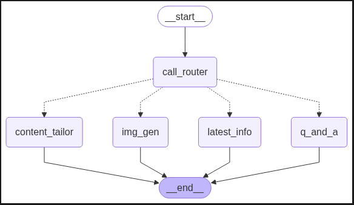

# AI Agent

An intelligent agent system built with LangChain, LangGraph, and FastAPI that combines graph-based routing with advanced language models to handle various types of queries including Q&A, real-time information retrieval, image generation, and social media content tailoring.

## Live Demo

The FastAPI application is deployed and accessible on Hugging Face Spaces:

- API Documentation: [https://root007x-ai-agent.hf.space/docs](https://root007x-ai-agent.hf.space/docs)
- Live Demo: [https://root007x.github.io/chat_interface/](https://root007x.github.io/chat_interface/)

### Authentication

You can use the following demo credentials to test the application:

- **Username:** mahadi
- **Password:** 12345

Alternatively, you can register with your own credentials using the registration form.

## Architecture



## Approach & Design

### Core Approach

- **Graph-Based Routing**: Implemented using LangGraph for intelligent task distribution and workflow management
- **Multi-Model Strategy**: Using specialized models for different tasks
  - Llama 3.3 70B Versatile: Primary model for general queries and content generation
  - OpenAI GPT-OSS 20B: Specialized for agent operations and tool usage

### Risk Controls

- **Input Validation**

  - All user inputs are validated using Pydantic models

- **Error Handling**

  - Comprehensive exception handling with custom error types
  - Detailed logging for debugging and monitoring

- **Security Measures**
  - JWT-based authentication
  - Bcrypt password hashing
  - CORS protection
  - Environment variable management for sensitive data

### Assumptions & Limitations

- **Model Capabilities**

  - Using open-source models (Llama 3.3 70B, GPT-OSS 20B) which may be slower than commercial alternatives
  - Models may not be as optimized as the latest commercial options
  - Real-time information requires external tool integration
  - Image generation has style and content limitations

- **API and Tools**

  - MCP tools use free-tier services which may have higher latency
  - Non-paid API services have rate limits and usage restrictions
  - Tool response times can vary significantly
  - Data retrieval might be slower compared to premium services

- **Performance**

  - Higher latency due to open-source model inference
  - Resource intensive operations due to model size
  - Concurrent handling may be limited by free-tier restrictions

## Features

- **Multi-Modal Capabilities**

  - Question & Answer
  - Real-time Web Search
  - Image Generation
  - Social Media Content Optimization

- **Intelligent Routing**

  - Automatic query classification
  - Task-specific node handling
  - State management with MemorySaver

- **Authentication & Security**

  - JWT-based authentication
  - Password hashing with bcrypt
  - Rate limiting
  - CORS support

- **API Integration**
  - FastAPI backend
  - Model Context Protocol (MCP) integration
  - Exa AI tools integration

## Tech Stack

- **Backend Framework**: FastAPI
- **AI/ML**:
  - LangChain
  - LangGraph
  - MCP (Model Context Protocol)
  - Models:
    - Llama 3.3 70B Versatile (Main LLM)
    - OpenAI GPT-OSS 20B (Agent LLM)
- **Tools & Services**:
  - Smithy AI (MCP Tools Provider)
  - Exa AI Search Integration
- **Database**: SQLite with SQLAlchemy
- **Authentication**: JWT with OAuth2
- **Testing**: Built-in backtest functionality

## Project Structure

```
.
├── auth/                           # Authentication related code
│   ├── __init__.py
│   ├── auth.py                    # Authentication logic
│   ├── db.py                      # Database configuration
│   ├── models.py                  # SQLAlchemy models
│   ├── routes.py                  # API routes
│   ├── schemas.py                 # Pydantic models
│   └── security.py                # Security utilities
├── backtest_result/               # Testing results and metrics
│   ├── content_result.csv        # Content generation test results
│   ├── image_result.csv         # Image generation test results
│   ├── latest_result.csv        # Real-time info test results
│   ├── qa_accuracy.png         # Q&A accuracy visualization
│   └── qa_result.csv           # Q&A test results
├── logs/                         # Application logs
│   ├── log_2025-08-16.log      # Daily logs
│   └── log_2025-08-17.log
├── notebook/                     # Jupyter notebooks
│   ├── ai_agent.ipynb          # Development notebook
│   └── image.png               # Test image
├── src/                         # Source code
│   ├── __init__.py
│   ├── components/             # Core components
│   │   ├── __init__.py
│   │   ├── agent.py           # Agent implementation
│   │   ├── graph.py           # Graph structure
│   │   ├── model.py           # LLM models
│   │   ├── node.py            # Node definitions
│   │   └── tools.py           # MCP tools
│   ├── config/                # Configuration
│   │   ├── __init__.py
│   │   └── config.py         # Configuration settings
│   └── utils/                 # Utilities
│       ├── __init__.py
│       ├── custom_exception.py # Custom error handling
│       └── logger.py          # Logging configuration
├── auth.db                     # SQLite database
├── backtest.py                # Testing script
├── main.py                    # Application entry point
├── pyproject.toml            # Project metadata and dependencies
├── README.md                 # Project documentation
├── requirements.txt          # Project dependencies
└── uv.lock                  # Dependency lock file
```

## Setup

1. Clone the repository:

```bash
git clone https://github.com/Root007x/ai_agent.git
cd ai_agent
```

2. Install dependencies:

```bash
pip install -r requirements.txt
```

3. Set up environment variables:

```bash
GROQ_API_KEY = your-secret-key
TOOL_API = your-mcp-api-key
```

4. Run the application:

```bash
uvicorn main:app --host 0.0.0.0 --port 8000 --reload
```

5. Access the Interactive API Documentation:

```
http://localhost:8000/docs
```

Here you can:

- Explore all API endpoints
- Test the endpoints directly in your browser
- View request/response schemas
- Try out the API with authentication

## API Usage Guide

### 1. User Registration (`/register`)

- Navigate to `http://localhost:8000/docs`
- Find the `/register` endpoint
- Click "Try it out" and enter your details:

```json
{
  "username": "your_username",
  "email": "your_email@example.com",
  "password": "your_password"
}
```

- Click "Execute" to create your account

### 2. Get Authentication Token (`/token`)

- Go to the `/token` endpoint
- Click "Try it out"
- Enter your credentials:
  - username: your_username
  - password: your_password
- Click "Execute" to get your access token

### 3. Authorize Your Requests

- Click the "Authorize" button at the top of the Swagger UI
- Enter your username and password
- Click "Authorize" to authenticate all future requests

### 4. Submit Tasks (`/task`)

- Go to the `/task` endpoint
- Click "Try it out"
- Enter your query in the request body:

```json
{
  "task": "What is artificial intelligence?"
}
```

- Click "Execute" to get the AI agent's response

## API Endpoints Summary

- **POST /register/** - Create new user account
- **POST /token** - Generate authentication token
- **POST /task** - Submit queries to AI agent

## Security

- Implements JWT authentication
- Password hashing using bcrypt
- CORS middleware for frontend integration
- Input validation using Pydantic models

## License

This project is licensed under the MIT License - see the LICENSE file for details.
